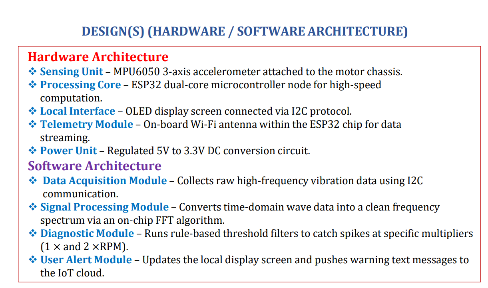

# ESP32 Vibration-Based Machine Fault Detector

A low-cost, standalone vibration monitor for rotating machines. An ESP32 reads an accelerometer, runs an FFT on the chip itself, works out *why* the machine is shaking, and trips a relay before the damage spreads. Wi-Fi is used only to send alerts to your phone.

> Built as an S7 Mini Project (Mechatronics Engineering, Bannari Amman Institute of Technology, Sathyamangalam), 2026.


<!-- Add your photos to /docs and keep these file names, or edit the paths. -->

## Problem

Industrial vibration analyzers are expensive, and cheap vibration sensors only say *how much* a machine shakes, not *what is wrong*. Small workshops, labs and appliances usually run until something breaks, which means unplanned downtime and costly repairs.

## Solution

A compact node that:

1. Samples machine vibration with an MPU6050 accelerometer.
2. Converts each batch of samples to a frequency spectrum with an on-chip FFT.
3. Applies simple rules to the spectrum to name the fault.
4. Reacts immediately: relay cut-off, buzzer, OLED message, and a phone alert.

The safety action happens entirely on the device. It does not depend on Wi-Fi or any cloud service.

## Fault detection logic

| Spectral signature | Diagnosed fault | Typical cause |
|---|---|---|
| Strong peak at 1x running speed | Mass unbalance | Uneven weight on a rotor |
| Strong peak at 2x running speed | Structural looseness | Loose mounting bolts, worn bearings |

A fault is declared when the peak amplitude at 1x or 2x rises above a threshold set from a healthy-machine baseline recorded during calibration.

## Hardware

| Part | Role |
|---|---|
| ESP32 dev board | Sampling, FFT, classification, Wi-Fi |
| MPU6050 (GY-521) | 3-axis accelerometer on the machine frame, I2C |
| SSD1306 OLED | Live status and fault label |
| 1-channel 5 V relay module | Cuts motor power on a fault |
| Active buzzer | Local alarm |
| Regulated 5 V / 3.3 V supply | Stable power for sensor and MCU |
| Lab-scale motor rig | Test bed for creating unbalance and looseness |

Full parts list and cost: [hardware/BOM.md](hardware/BOM.md)

### Wiring

| From | To (ESP32) |
|---|---|
| MPU6050 SDA / SCL | GPIO __ / GPIO __ (shared I2C bus) |
| SSD1306 SDA / SCL | Same I2C bus as the MPU6050 |
| Relay SIG | GPIO __ |
| Buzzer | GPIO __ |
| Sensor, OLED, relay power | 3.3 V / 5 V and GND as per the circuit diagram |

Fill in the GPIO numbers from your firmware. Circuit diagram: `docs/circuit_diagram.png`

## How it works

```
MPU6050 --I2C--> ESP32 --> FFT --> rule-based classifier --> relay / buzzer / OLED / phone alert
```

- **Acquisition:** a timer interrupt triggers fixed-rate sampling (1000 Hz) of the accelerometer over I2C.
- **Windowing:** samples are collected in blocks of 128.
- **FFT:** a Radix-2 Cooley-Tukey FFT turns each block into a spectrum. With 128 samples at 1000 Hz, each frequency bin is about 7.81 Hz wide.
- **Diagnosis:** the amplitudes at 1x and 2x the running frequency are compared to calibrated thresholds.
- **Action:** on a fault, the relay opens, the buzzer sounds, the OLED shows the fault name, and a notification is sent through Blynk or ThingSpeak/Telegram.

## Software setup

1. Install the Arduino IDE and add ESP32 board support.
2. Install the libraries your sketch uses (for example an MPU6050 driver, Adafruit SSD1306 + GFX, and Blynk or your chosen notification library).
3. Copy `firmware/secrets.example.h` to `firmware/secrets.h` and fill in your Wi-Fi and notification credentials. This file is git-ignored, so your secrets stay private.
4. Open `firmware/vibration_monitor.ino`, select your ESP32 board and port, and upload.
5. With the machine running healthy, run the calibration step to record the baseline, then set the fault thresholds.

## Testing plan and status

- [x] Sensor interfacing and data acquisition firmware
- [x] On-chip FFT implementation
- [x] Rule-based fault logic
- [ ] Final testing of the FFT code on the microcontroller
- [ ] Threshold optimisation
- [ ] Tests with real unbalance and looseness on the motor rig
- [ ] Evaluation at different motor speeds

## Results

_Add your measurements here once testing is done._

| Test | Expected | Observed |
|---|---|---|
| Healthy motor | No alarm | |
| Added mass (unbalance) | 1x peak, "Unbalance" label | |
| Loosened mount (looseness) | 2x peak, "Looseness" label | |
| Fault-to-relay-cut time | | ms |

Suggested figures for `docs/`: a spectrum of a healthy run vs a faulty run, and a photo of the OLED showing a fault label.

## Safety

If the relay switches mains voltage, use a properly rated, isolated relay module, an enclosed terminal block, and have a qualified person check the wiring. Test with a low-voltage motor first.

## Future scope

- Adaptive thresholds that learn the machine's normal behaviour
- Additional faults such as misalignment and bearing defects
- A TinyML classifier in place of fixed rules
- A wireless sensor network for monitoring several machines

## References

1. M. Tiboni, C. Remino, R. Bussola, and C. Amici, "A review on vibration-based condition monitoring of rotating machinery," *Applied Sciences*, vol. 12, no. 3, p. 972, Jan. 2022.
2. L. Song, H. Wang, and P. Chen, "Vibration-based intelligent fault diagnosis for roller bearings in low-speed rotating machinery," *IEEE Transactions*, 2018.
3. R. B. Randall, *Vibration-Based Condition Monitoring: Industrial, Automotive and Aerospace Applications*, 2nd ed. Chichester, UK: Wiley, 2021.
4. J. C. Robinson, B. Vanvoorhis, and W. Miller, "Machine fault detection using vibration signal peak detector," U.S. Patent 5,895,857, Apr. 20, 1999.
5. SKF Group, "Vibration analysis and condition monitoring basics." [Online]. Available: https://www.skf.com
6. Analog Devices, "Choosing the right accelerometer for machinery condition monitoring." [Online]. Available: https://www.analog.com

## License

MIT, see [LICENSE](LICENSE).
